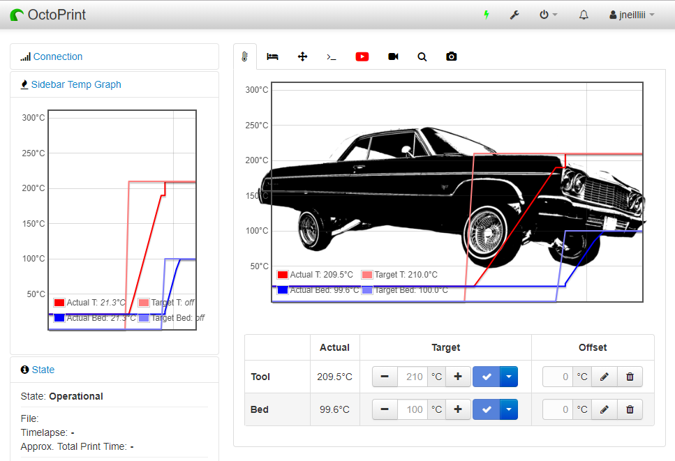

## OctoPrint-SideBarTempGraph

Small plugin that adds a temperature graph to the sidebar.  

**Note:** To change the location of the graph within the Sidebar install [OctoPrint-SidebarOrder](https://github.com/zoombahh/OctoPrint-SidebarOrder) plugin. Use `plugin_sidebartempgraph` for the sidebar identifier in that plugin's settings.

### Screenshot

### Setup

Install via the bundled Plugin Manager or manually using this URL:

https://github.com/jneilliii/OctoPrint-SideBarTempGraph/archive/master.zip

## Support My Efforts
I programmed this plugin for fun and do my best effort to support those that have issues with it, please return the favor and support me.

